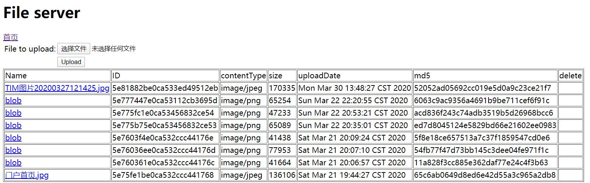

# 文件服务器
## 构建工具
gradle4.7
## 功能
1. 可以存放图片文件等
2. 可以删除图片文件等
3. 可以展示图片文件等
4. 可以将上传的图片文件进行下载
## 数据库
使用MongoDB对文件进行存储
## 相关配置
如果使用内嵌mongoDB,可以将build.gradle下的依赖取消注释  
`compile('de.flapdoodle.embed:de.flapdoodle.embed.mongo')`  
如果自己本地已经装了mongoDb,可以不使用内嵌的,将application.yml下的数据库的密码改为自己的即可
## 展示页面

